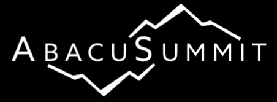

# AbacusSummit

This is the public repository for the specification, utilization,
and documentation of the AbacusSummit suite of high-performance
cosmological N-body simulations.  

With 60 trillion particles evolved at high accuracy, AbacusSummit 
is the largest cosmological N-body simulation suite yet produced.
These simulations were designed
to meet (and exceed) the Cosmological Simulation Requirements of
the Dark Energy Spectroscopic Instrument (DESI) survey.  AbacusSummit
was run on the Summit supercomputer at the Oak Ridge Leadership
Computing Facility under a time allocation from the DOE's ALCC
program.

The bulk of the documentation is [here](https://abacussummit.readthedocs.io).

The cosmology grid is specified [here](https://abacussummit.readthedocs.io/en/latest/cosmologies.html).

The simulations themselves are specified [here](https://abacussummit.readthedocs.io/en/latest/simulations.html).

The [abacusutils](https://github.com/abacusorg/abacusutils) package can be used to read the halo catalogs and other data products.

Abacus is a high-accuracy cosmological N-body simulation code.  It
is optimized for GPU architectures and for large volume, moderately
clustered simulations.  It is extremely fast: we clock over 30
million particle updates per second on commodity dual-Xeon, dual-GPU
computers and nearly 70 million particle updates per second on each
node of the Summit supercomputer.  But it is also extremely accurate:
typical force accuracy is below 1e-5 and we are using global
timesteps, so the leapfrog timesteps away from the cluster cores
are much smaller than the dynamical time.

Abacus is described in [Garrison et al. (2019, MNRAS, 485, 3370)](https://academic.oup.com/mnras/article/485/3/3370/5371170),
where we detail its performance on the [Schneider et al. (2016)](https://iopscience.iop.org/article/10.1088/1475-7516/2016/04/047) code
comparison simulation, and in [Garrison et al. (2018, ApJS, 236,
43)](https://iopscience.iop.org/article/10.3847/1538-4365/aabfd3), which released an early suite of 125 simulations from 40
cosmologies (https://lgarrison.github.io/AbacusCosmos/).

Abacus is currently actively developed by Lehman Garrison, Nina
Maksimova, and Daniel Eisenstein, with contributions from Boryana
Hadzhiyska and Sownak Bose and consulting from Philip Pinto.  Abacus
was initially developed by Marc Metchnik and Philip Pinto, with
contributions from Daniel Eisenstein and later development led by
Douglas Ferrer.

Abacus development has been supported by NSF AST-1313285 and more
recently by DOE-SC0013718, as well as by Simons Foundation funds
and Harvard University startup funds.  NM was supported as a NSF
Graduate Research Fellow.  The AbacusCosmos simulations were run
on the El Gato supercomputer at the University of Arizona, supported
by grant 1228509 from the NSF; the AbacusSummit simulations have
been supported by OLCF projects AST135 and AST145, the latter through
the Department of Energy ALCC program.

Use of AbacusSummit should follow the [academic citation guidelines](https://abacussummit.readthedocs.io/en/latest/citation.html)
in the documentation.
