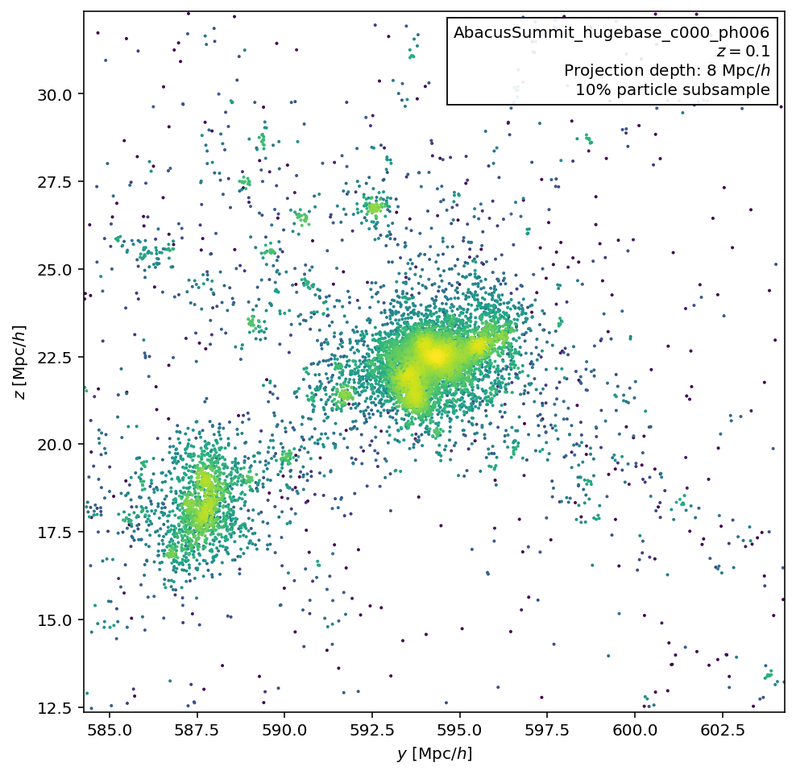
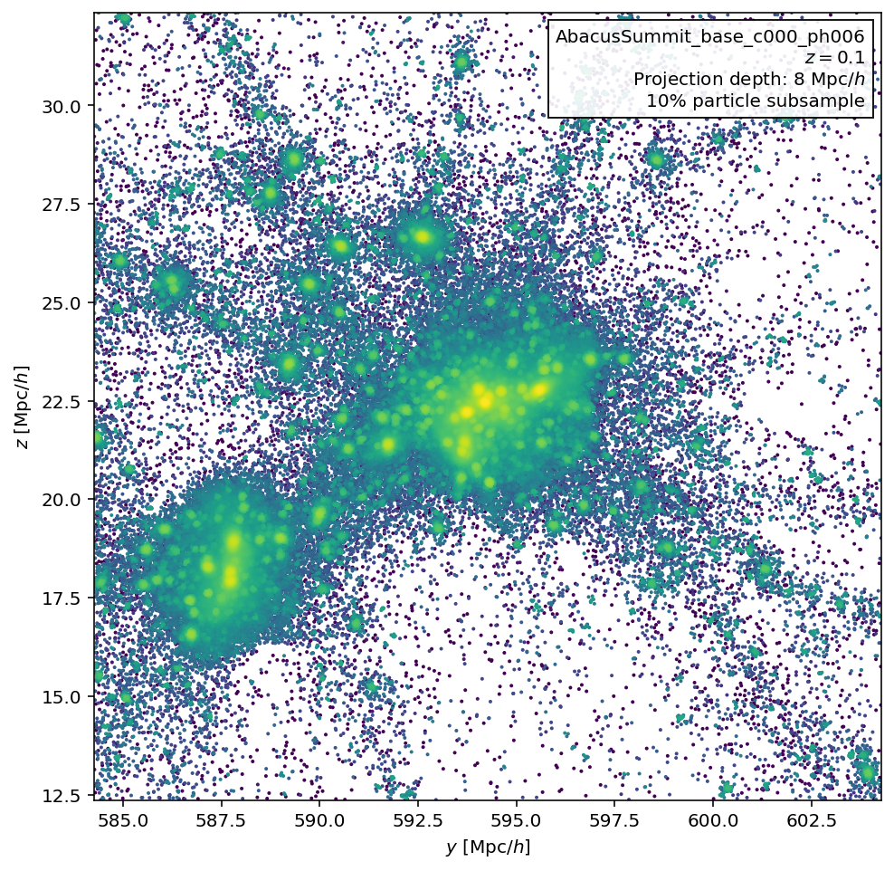
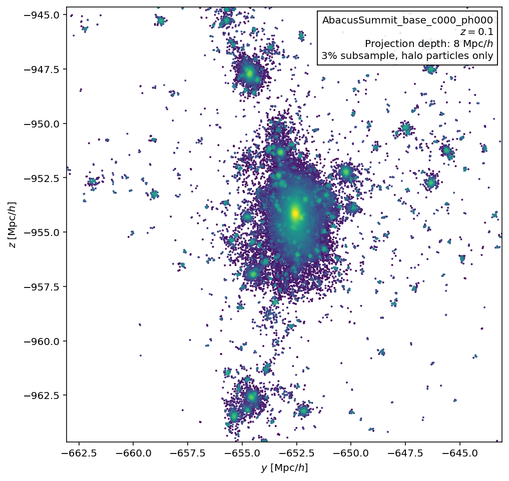
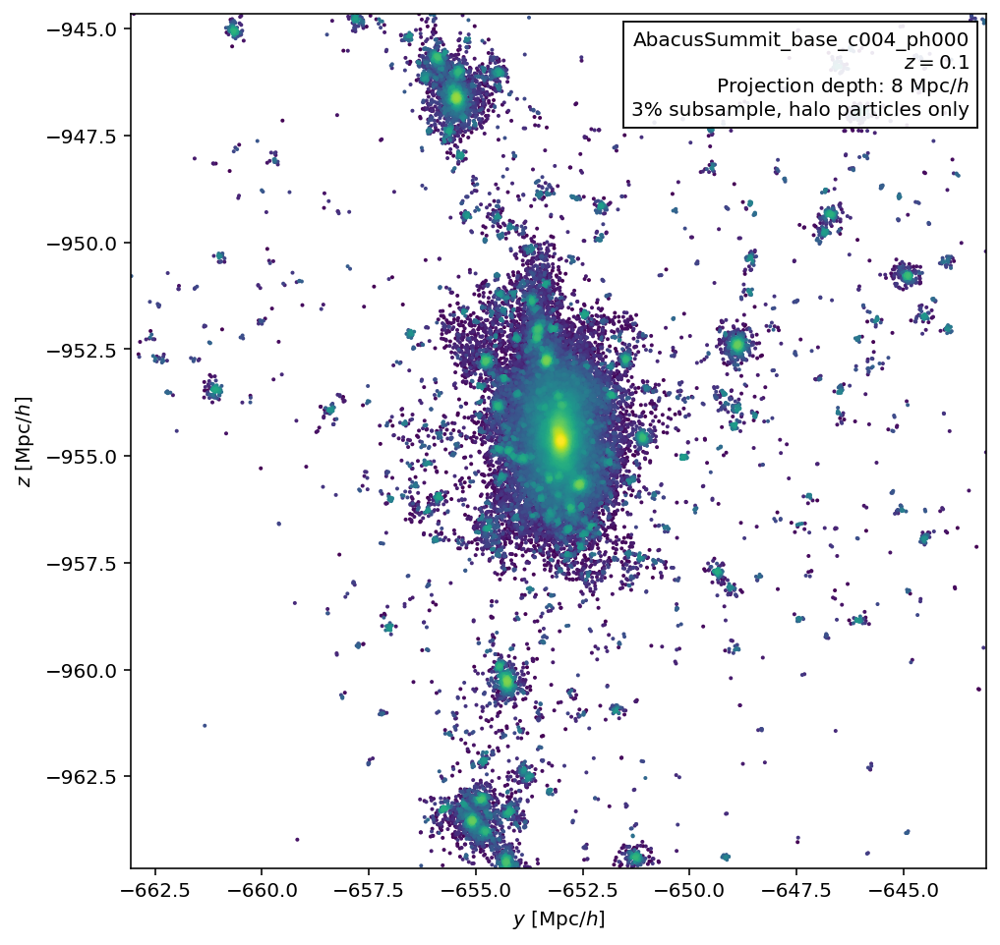

Visualizations
==============

The following is a collection of visualizations produced from AbacusSummit data.  These images may be used under the `CC-BY-4.0 <https://creativecommons.org/licenses/by/4.0/>`_ license, with attribution to "The AbacusSummit Team".

Phase-matching test
-------------------

    A visualization of the same halo at two different mass resolutions.  Try opening both of these images and blinking back and forth between them!
    

Same halo, two cosmologies
--------------------------

    A visualization of the same halo in c000 (the base cosmology) and c004 (low sigma8 cosmology).  Try opening both of these images and blinking back and forth between them!
