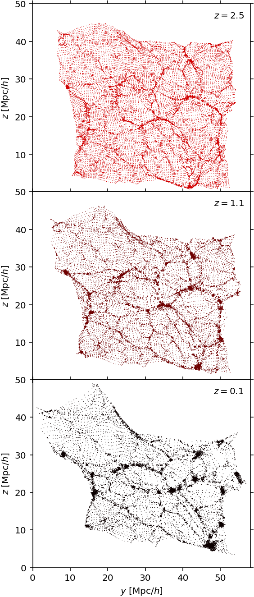

Visualizations
==============

The following is a collection of visualizations produced from AbacusSummit data.  These images may be used under the `CC-BY-4.0 <https://creativecommons.org/licenses/by/4.0/>`_ license, with attribution to "The AbacusSummit Team".

Summary Figures
---------------
.. figure:: images/AbacusSummit_slide_dpi72.png

    A summary slide/poster. Download here: :download:`72 dpi PNG (1 MB) <images/AbacusSummit_slide_dpi72.png>`.  A high-res PDF version of this image is available here: :download:`PDF (10 MB) <images/AbacusSummit_slide.pdf>`.  Layout and design credit: Lucy Reading-Ikkanda.
    
.. figure:: images/abacussummit_dpi192_portrait.png

    A vertical summary slide/poster. Download here: :download:`192 dpi PNG (1.4 MB) <images/abacussummit_dpi192_portrait.png>`.  An older version with a different color scheme is available here: :download:`192 dpi PNG (2 MB) <images/abacussummit_dpi192_portrait_old.png>`
    
Phase-sheet Evolution
---------------------

    A single cutout of a Lagrangian plane---a square from a particle plane selected in the initial conditions---at redshifts :math:`z=2.5`, :math:`z=1.1`, :math:`z=0.1` from the highbase simulation.  The "memory" of the initial lattice configuration persists to low redshift in low-density regions.  Download here: :download:`PNG (725 KB) <images/lattice_memory_multi.png>`.

Phase-matching test
-------------------

.. figure:: images/AbacusSummit_hugebase_c000_ph006_halo_zoom.png

.. figure:: images/AbacusSummit_base_c000_ph006_halo_zoom.png

    A visualization of the same halo at two different mass resolutions.  Try opening both of these images and blinking back and forth between them!
    

Same halo, two cosmologies
--------------------------
.. figure:: images/AbacusSummit_base_c000_ph000_halo_zoom.png

    A visualization of the same halo in c000 (the base cosmology) and c004 (low sigma8 cosmology).  Try opening both of these images and blinking back and forth between them!
