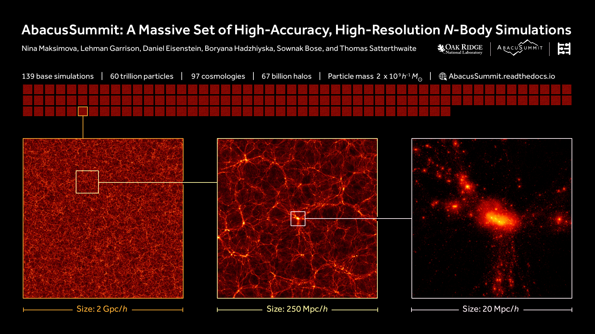

Visualizations
==============

The following is a collection of visualizations produced from AbacusSummit data.  These images may be used under the `CC-BY-4.0 <https://creativecommons.org/licenses/by/4.0/>`_ license, with attribution to "The AbacusSummit Team".

Summary Figures
---------------

    A summary slide/poster. Download here: :download:`72 dpi PNG (1.2 MB) <images/AbacusSummit_slide_dpi72.png>`.  A high-res PDF version of this image is available here: :download:`PDF (7.7 MB) <images/AbacusSummit_slide.pdf>`.  Layout and design credit: Lucy Reading-Ikkanda.
    
.. figure:: images/abacussummit_dpi192_portrait.png

    A vertical summary slide/poster. Download here: :download:`192 dpi PNG (1.4 MB) <images/abacussummit_dpi192_portrait.png>`.  An older version with a different color scheme is available here: :download:`192 dpi PNG (2 MB) <images/abacussummit_dpi192_portrait_old.png>`
    
Video: "Many Universes"
-----------------------
.. raw:: html
    
    <video width="480" height="480" controls>
    <source src="https://d1qdmld16vdglj.cloudfront.net/abacussummit_universes_scatter_fps48_1080p.webm" type="video/webm">
    Your browser does not support the video tag.
    </video>

With AbacusSummit, we simulate many possible universes that are slight variations of each other. This video shows nearly 100 of those universes, transitioning smoothly between them by interpolating the positions of individual particles.

Two resolutions are available for download: :download:`1080p (300 MB) <https://d1qdmld16vdglj.cloudfront.net/abacussummit_universes_scatter_fps48_1080p.webm>` and :download:`1440p (700 MB) <https://d1qdmld16vdglj.cloudfront.net/abacussummit_universes_scatter_fps48_1440p.webm>`.  The videos are VP9-encoded, so you may need a relatively modern video player or web browser to play them. The bitrate is also fairly high, so you probably need GPU-accelerated video decoding for the video to play smoothly.

    
Phase-sheet Evolution
---------------------
.. figure:: images/lattice_memory_multi.png

    A single cutout of a Lagrangian plane---a square from a particle plane selected in the initial conditions---at redshifts :math:`z=2.5`, :math:`z=1.1`, :math:`z=0.1` from the highbase simulation.  The "memory" of the initial lattice configuration persists to low redshift in low-density regions.  Download here: :download:`PNG (725 KB) <images/lattice_memory_multi.png>`.

Phase-matching test
-------------------

.. figure:: images/AbacusSummit_hugebase_c000_ph006_halo_zoom.png

.. figure:: images/AbacusSummit_base_c000_ph006_halo_zoom.png

    A visualization of the same halo at two different mass resolutions.  Try opening both of these images and blinking back and forth between them!
    

Same halo, two cosmologies
--------------------------

.. figure:: images/AbacusSummit_base_c004_ph000_halo_zoom.png

    A visualization of the same halo in c000 (the base cosmology) and c004 (low sigma8 cosmology).  Try opening both of these images and blinking back and forth between them!
